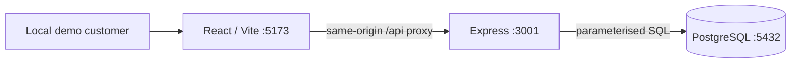

# Architecture

## Scope and boundary

One repository contains the system under test and its quality evidence. A React/Vite frontend calls Express JSON endpoints; the API uses a pg connection pool to reach PostgreSQL. pnpm workspaces and strict TypeScript share tooling without introducing a shared domain package. Runtime JSON still requires validation.

## Persistence decisions

- Users have UUID, unique email, customer/staff role and nullable password_hash. Migration 002 enables existing M1 users without deleting them; credential seeding sets customer hashes.
- Sessions store a SHA-256 digest of a random 256-bit token, user reference and expiry. The raw token is only sent in an HttpOnly cookie; it is not persisted as plaintext.
- Slots have start/end instants with end > start.
- Bookings reference a slot and customer and have confirmed/cancelled state and creation instant. Cancellation preserves the booking record and changes its status.
- A partial unique index on slot_id where status = confirmed prevents multiple confirmed bookings for one slot, including independent writers.
- Authenticated requests provide only slotId. The service injects the session customer ID and rejects caller-supplied identity. A single INSERT … SELECT checks that the slot is future and the user is a customer and writes the booking. No application availability precheck substitutes for the unique index.
- The service translates only the named capacity constraint into 409; other persistence failures remain unexpected errors.
- The database validates referential integrity. Customer-role eligibility is enforced by the API query, not a cross-table database constraint; future administrative/direct SQL writes require care.

## Simplicity and trade-offs

Express is sufficient for this small JSON service. A small repository interface isolates the booking boundary for unit tests without a framework-heavy service layer. SQL is explicit, allowing interview discussion and direct persistence checks. There is no ORM, queue or microservice. Notifications will require a decision about an observable retry/outbox mechanism later.

Slots are future relative to the database clock. PostgreSQL stores instants using timestamptz; pg serialises dates to ISO UTC. The UI formats in Australia/Brisbane. Sydney daylight-saving coverage is deferred.

Migrations 001 and 002 are tracked transactionally in schema_migrations; a lock serialises migration attempts. The seed uses fixed IDs and ON CONFLICT DO NOTHING; reruns preserve bookings and original slot timestamps, reset demo credential hashes and revoke customer sessions. `pnpm db:seed:more` explicitly appends a new three-slot Brisbane day without deleting existing bookings. It chooses at least two days ahead and after the latest slot date; a table lock serialises simultaneous replenishment commands. Seeds are development data, not isolated automated-test fixtures.

## Authentication and operations

See [authentication decisions](AUTHENTICATION.md). Customers log in using scrypt-hashed passwords. Sessions have a fixed eight-hour lifetime, are rotated on login when a prior cookie is supplied, and are deleted on logout. Booking identity comes from a verified session. Slot browsing remains public. POST Origin validation and JSON enforcement complement a SameSite=Strict cookie; production-mode cookies are Secure, while loopback HTTP development cookies are not.

This remains a local demonstration. No registration or staff login yet. No login rate limiting, expired-session garbage collection, deployed build serving or readiness endpoint. Vite is the local frontend server; build output is verified separately. Idempotency and safe ambiguous-outcome retries are deferred to M4. Session expiry uses the API clock; keep server clocks consistent if expanding deployment.

## Ownership and cancellation

Listing and reading bookings filter on the session customer ID. Cancellation performs one `UPDATE ... WHERE id = $1 AND customer_id = $2`, then joins the slot for the returned times. A missing or foreign booking returns the same 404. Staff access is denied. Repeating cancellation returns the same cancelled record; it cannot cancel a different booking that subsequently uses that slot. No fees/cutoff policy is modelled. Available-slot queries continue to include only future slots.

Changing status to cancelled removes that row from the partial unique index, allowing a new confirmed booking for the slot. No schema change was needed. Booking creation still has no idempotency-key/replay contract. The UI separates a successful write from a later refresh failure and tells the user to reload when the network leaves the write outcome unknown.

## UI test environment

Playwright starts distinct API/web processes on 3101/5174. Vite's API_ORIGIN override selects the test API. The test server receives only TEST_DATABASE_URL as DATABASE_URL; a `_test` database-name guard rejects the ordinary demo database. It runs the same migrations as development. Per-test fixtures create two independent customers and one future slot, assert selected SQL outcomes, attach scoped failure state before teardown, and clean their own rows transactionally. No test-only HTTP routes or shared seed accounts are exposed.

The PR workflow uses PostgreSQL 17.6, Node 24 and the pnpm version declared in package.json. Local verification used PostgreSQL 18.4 because Docker was unavailable; the exact CI environment and artefact upload remain pending.
