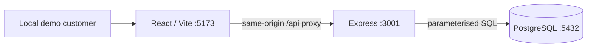

# Architecture

## Scope and boundary

One repository contains the system under test and its quality evidence. A React/Vite frontend calls Express JSON endpoints; the API uses a pg connection pool to reach PostgreSQL. pnpm workspaces and strict TypeScript share tooling without introducing a shared domain package. Runtime JSON still requires validation.

## Persistence decisions

- Users have UUID, unique email and customer/staff role. No passwords are stored in this slice; it has no authentication.
- Slots have start/end instants with end > start.
- Bookings reference a slot and customer and have confirmed/cancelled state and creation instant. Cancellation behaviour is not implemented yet.
- A partial unique index on slot_id where status = confirmed prevents multiple confirmed bookings for one slot, including independent writers.
- A single INSERT … SELECT checks that the slot is future and the user is a customer and writes the booking. No application availability precheck substitutes for the unique index.
- The service translates only the named capacity constraint into 409; other persistence failures remain unexpected errors.
- The database validates referential integrity. Customer-role eligibility is enforced by the API query, not a cross-table database constraint; future administrative/direct SQL writes require care.

## Simplicity and trade-offs

Express is sufficient for two routes. A small repository interface isolates the booking boundary for unit tests without a framework-heavy service layer. SQL is explicit, allowing interview discussion and direct persistence checks. There is no ORM, queue or microservice. Notifications will require a decision about an observable retry/outbox mechanism later.

Slots are future relative to the database clock. PostgreSQL stores instants using timestamptz; pg serialises dates to ISO UTC. The UI formats in Australia/Brisbane. Sydney daylight-saving coverage is deferred.

The first migration is tracked transactionally in schema_migrations; a lock serialises migration attempts. The seed uses fixed IDs and ON CONFLICT DO NOTHING; reruns preserve data and original slot timestamps. `pnpm db:seed:more` explicitly appends a new three-slot Brisbane day without deleting existing bookings. It chooses at least two days ahead and after the latest slot date; a table lock serialises simultaneous replenishment commands. Seeds are development data, not isolated automated-test fixtures.

## Deferred security and operations

Customer IDs are untrusted caller input; ownership cannot be claimed. Bind API/database to loopback and use only a disposable local environment until authentication/authorisation exists. No rate limiting, deployed build serving, readiness endpoint, login, list-own-bookings or cancellation endpoint yet. Vite is the local frontend server; build output is verified separately. Idempotency keys and safe ambiguous-outcome retries are deferred to M4.
