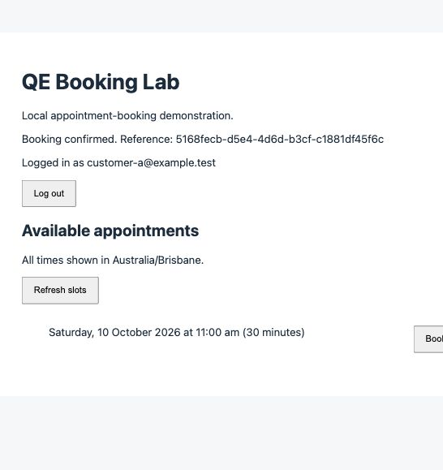

# M2 result compared with the original plan

Historical authentication-slice checkpoint. Subsequent implementation and current evidence: [M2-IMPLEMENTATION.md](M2-IMPLEMENTATION.md).

Reviewed and reverified 7 October 2026 (Australia/Brisbane), on codex/customer-authentication. M1 checkpoint: ddd9b87. M2 implementation remains uncommitted.

## Verdict

The agreed first M2 slice (customer login/logout and booking creation owned by the authenticated customer) passes the checks executed below. The original **M2 — Initial UI Quality Engineering** milestone is incomplete. Its definition of done requires useful Playwright checks on pull requests with diagnostic evidence; none of that automation/CI infrastructure exists yet.

The narrower slice was agreed before implementation: stop before cancellation or Playwright automation. Authentication is a prerequisite for those journeys, not a replacement for their acceptance criteria. The roadmap correctly marks M2 in progress.

## Original plan comparison

| Original M2 expectation                                                 | Current evidence / result                                                                                                                           | Status                                            |
| ----------------------------------------------------------------------- | --------------------------------------------------------------------------------------------------------------------------------------------------- | ------------------------------------------------- |
| Approximately 5–10 meaningful Playwright scenarios                      | No Playwright configuration, dependency or UI tests. 18 checks are backend/HTTP checks.                                                             | Pending                                           |
| Customer login                                                          | Implemented; password/session checks and manual browser journey pass.                                                                               | Behaviour ready; UI automation pending            |
| View available slots                                                    | Implemented and visible before/after login.                                                                                                         | Behaviour ready; UI automation pending            |
| Create booking                                                          | Browser confirmation matches authenticated Customer A in SQL.                                                                                       | Behaviour ready; UI automation pending            |
| Cancel booking                                                          | No cancellation route or UI.                                                                                                                        | Pending                                           |
| Invalid booking attempt                                                 | Backend/HTTP rejects invalid input, missing session and caller-supplied identity.                                                                   | Backend evidence available; UI automation pending |
| Customer cannot access another user's booking through UI, if applicable | Read-own-bookings and cancellation endpoints/UI are not implemented. Creation identity is protected; this does not establish read/cancel ownership. | Pending when those flows exist                    |
| Reusable fixtures / controlled data                                     | Database doubles in focused tests; one-off real-DB verification uses disposable data. No reusable Playwright fixtures.                              | Pending                                           |
| HTML report and trace on failure                                        | No Playwright runner/report/trace setup. Screenshots from manual verification are not automated failure artefacts.                                  | Pending                                           |
| CI execution and diagnostic publishing                                  | .github/workflows contains only .gitkeep. No PR checks or artefact uploads.                                                                         | Pending                                           |

## Checks rerun today

- pnpm lint, format:check, typecheck and build: passed.
- pnpm test: all 18 checks passed (7 booking, 7 password/session, 4 HTTP boundary with a database double).
- Real PostgreSQL integration verification: passed on PostgreSQL 18.4 in a separate temporary database. Login, hashed session persistence, cookie attributes, owner identity, spoof rejection, 401/403/409 responses, rotation, expiry, logout and repeated migration/seed were asserted. That database was dropped afterward.
- Live browser: login → controlled test-slot booking → reload retains login → logout disables booking. SQL confirmed the booking owner is Customer A.

Today's browser booking evidence before cleanup:

```text
id          5168fecb-d5e4-4d6d-b3cf-c1881df45f6c
slot_id     40000000-0000-4000-8000-000000000007
customer_id 00000000-0000-4000-8000-000000000001
status      confirmed
```



The temporary slot and its single booking were removed after the SQL check; the original manual-demo booking count was restored to 8. This screenshot records a deliberately temporary test booking, not a booking that still exists.

## Environment and evidence limits

The API and temporary database had stopped between sessions; the first live verification attempt returned connection refused. Restarting the existing PostgreSQL data directory and development servers restored the local environment without reseeding manual data. Code checks had already passed independently of those services.

Real-database assertions were rerun using the temporary verification script outside the repository. Manual reproduction steps are in M2-VERIFICATION.md; the repository does not yet contain a reusable real-DB test harness. Automated-test doubles cannot establish database enforcement.

Docker Compose 17.6 / fresh-clone startup remains an M1 gap. There are no current concurrency/performance results or CI runs. No failure was found in the exercised authentication happy path and rejection paths; this is bounded verification, not exhaustive security assurance. Login rate limiting, deployment/TLS and expired-session cleanup remain documented local-demo limitations.

## Recommended next work

1. Finish view-own-bookings and owner-only cancellation as a small vertical slice. Define repeated cancellation behaviour and confirm capacity is restored.
2. Build isolated Playwright fixtures and approximately 5–10 risk-focused scenarios around complete customer journeys.
3. Configure HTML reports, failure traces and CI artefact upload; execute an intentional test failure to verify the diagnostics are useful.
4. Mark M2 complete only after pull requests actually run those checks and publish evidence. Keep the independent M1 Docker gap visible until exercised.

No application source was changed, committed or pushed during this verification. Only the review/evidence documentation was added.
