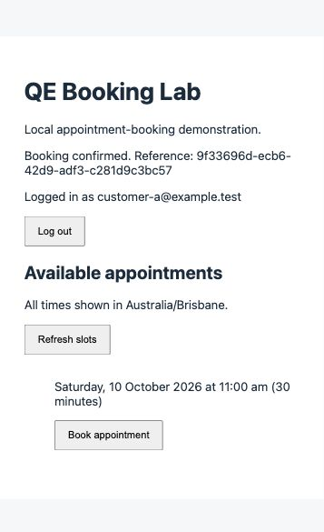

# M2 customer authentication — verification

Historical authentication-slice checkpoint. Subsequent implementation and current evidence: [M2-IMPLEMENTATION.md](M2-IMPLEMENTATION.md).

Executed 6 October 2026 (Australia/Brisbane), with AI-assisted implementation and actual execution. This verifies the first M2 slice, not the whole milestone.

## Environment

Same macOS/bundled Node 24.19.0 and pnpm 11.19.0 environment as M1. Real PostgreSQL 18.4 on the temporary local server; Compose 17.6 and fresh-clone container startup remain unverified. API/frontend bind to loopback. Local .env contains a generated demo password and is ignored by Git; no credential is included in this evidence.

## Focused checks

18 checks: 7 booking service checks, 7 password/authentication checks and 4 HTTP boundary checks with a database double. They cover identity injection, spoof rejection, staff denial, validation/conflict handling, salts/password verification, generic credential failure, expiry boundary, rotation, logout and malformed cookies. The route checks cover 401 without a session, 403 cross-origin, 400 caller identity and persistence parameters derived from the session.

Lint, formatting, typecheck and build passed. HTTP tests require a loopback socket. The desktop sandbox blocked the first route-test run; the elevated run passed. The harness now propagates Express listen errors correctly instead of reading a missing server address.

## Real PostgreSQL checks

A separate ephemeral database was created, migrated twice and seeded. A temporary HTTP server exercised the current built API. Assertions passed for:

- Successful login and stored session digest (raw cookie token absent from persistence).
- Cookie HttpOnly, SameSite=Strict, Path=/api and Max-Age=28800.
- Wrong password / unknown email → 401; disallowed or missing POST Origin → 403.
- Valid session /auth/me → 200.
- Missing/malformed session booking → 401, no booking.
- Caller-supplied Customer B identity → 400, no booking.
- Valid booking → 201; SQL owner is Customer A, status confirmed.
- Same-slot retry → 409; booking count remains 1.
- Login rotates a supplied prior session; old cookie → 401.
- Session timestamp set into the past → booking 401.
- Logout → 204; replay → 401.
- Repeated credential seed preserves the booking and revokes demo sessions.

The ephemeral database was dropped after verification. Its test data did not enter the manual demo database. This was one-off integration verification; a reusable full API suite remains M4 work.

## Manual browser journey

Observed login as Customer A → book 10 October at 10 am Brisbane → reload retains login → logout returns the login form and disables booking.

SQL matched the browser confirmation:

```text
id          9f33696d-ecb6-42d9-adf3-c281d9c3bc57
slot_id     8b761f5f-f590-8e6c-803c-f905d3e68bdc
customer_id 00000000-0000-4000-8000-000000000001
status      confirmed
```



## Reproduction

Follow the updated README: configure a local password and APP_ORIGIN, migrate, seed, start, log in and book an available slot. For an existing M1 database, migrations/seed preserve prior bookings; use seed:more if no future capacity remains. Inspect the browser request body and use a database query for its booking reference.

In browser developer tools, resend the booking request with an extra customerId to assert 400, then without its Cookie to assert 401. A same-slot retry with only slotId and a valid session gives 409. Credential reseeding intentionally logs customers out. Testing persisted expiry should use a separate disposable database/session, not overwrite another tester's session.

## Remaining work

View-own-bookings, cancellation, registration/staff flows, Playwright fixtures/reports/traces and CI remain pending. No concurrent-capacity or performance result is claimed. Local-only limitations include brute-force controls, TLS/deployment configuration and expired-session garbage collection.

## Original-plan audit and rerun

See [the 7 October plan review](M2-PLAN-REVIEW.md) for rerun results, controlled-data cleanup and the explicit distinction between the completed authentication slice and the incomplete original M2 milestone.
