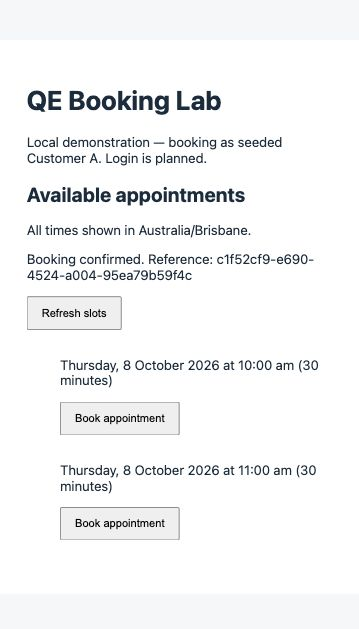
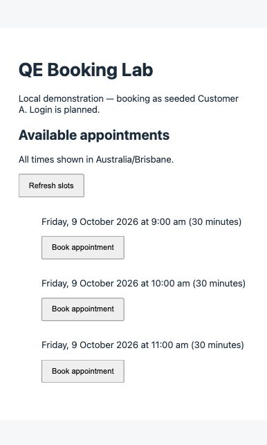

# First-slice verification

Historical M1 evidence; the current authentication slice is recorded in [M2-VERIFICATION.md](M2-VERIFICATION.md).

Executed 6 October 2026 (Australia/Brisbane). AI-assisted implementation; the outcomes below were observed during actual execution.

## Environment and limits

macOS; bundled Node 24.19.0 and pnpm 11.19.0. Docker is unavailable. A temporary `embedded-postgres` package outside this repository started a **real PostgreSQL 18.4 server** bound to 127.0.0.1:55432. It is not a project dependency or replacement for Compose. Compose targets PostgreSQL 17.6; container startup and that exact PostgreSQL version remain unverified.

The local ignored `.env` points at the temporary verification database. On another machine, copy `.env.example` and follow README. The baseline migration/seed/dev commands ran with that database URL. The desktop sandbox required elevated execution for database shared memory and local server/tsx sockets. A sandbox-specific pnpm store discrepancy required `pnpm_config_verify_deps_before_run=false` during local checks; normal clone/install instructions use the committed lockfile.

## Executed checks

| Check                              | Observed result                                                                     |
| ---------------------------------- | ----------------------------------------------------------------------------------- |
| `pnpm test`                        | 5 backend unit tests passed                                                         |
| `pnpm typecheck`                   | API and web passed                                                                  |
| `pnpm lint`                        | Passed after allowing intentionally unused Express error-handler argument           |
| `pnpm build`                       | API compiled; Vite frontend production build passed                                 |
| `pnpm format:check`                | Passed on final files                                                               |
| `pnpm db:migrate` / `pnpm db:seed` | Succeeded; both repeated twice without duplicate data or booking loss               |
| Browser local journey              | Three slots displayed; clicking 9 am confirmed booking and left two available slots |
| SQL persistence                    | Booking reference matched UI; expected customer/slot/status confirmed               |
| Occupied slot POST                 | 409 `SLOT_UNAVAILABLE`; original row retained                                       |
| Malformed UUID / JSON              | 400                                                                                 |
| Staff customer ID                  | 422; no booking created                                                             |
| Missing or past slot               | 422; no booking created                                                             |
| Post-rerun SQL counts              | 3 users, 3 slots, 1 booking, 1 migration record                                     |

## Concrete evidence

Browser-created booking:

```text
id          c1f52cf9-e690-4524-a004-95ea79b59f4c
slot_id     10000000-0000-4000-8000-000000000009
customer_id 00000000-0000-4000-8000-000000000001
status      confirmed
```



Reproduction on a fresh local database: follow README, book the 9 am slot, query bookings, then retry that slot:

```sh
curl -i http://127.0.0.1:3001/api/bookings \
  -H 'Content-Type: application/json' \
  -d '{"slotId":"10000000-0000-4000-8000-000000000009","customerId":"00000000-0000-4000-8000-000000000001"}'
docker compose exec db psql -U qe -d qe_lab -c 'SELECT id, slot_id, customer_id, status FROM bookings;'
```

Expected retry: HTTP 409 with `SLOT_UNAVAILABLE`. Query the new environment's booking reference; UUIDs differ across executions. Repeat migration and seed, then confirm counts and the booking reference remain unchanged. Checks above were one-off verification, not an API automation suite.

## Scope pending at the M1 checkpoint

Authentication, ownership, cancellation, idempotent replay, 20-request concurrency evidence, Playwright automation, CI artefacts, notification failure, Sydney DST, performance and defect exercises remain deferred. No benchmark, concurrent-capacity test or completed defect story is claimed. The unique index is implemented but concurrent behaviour still requires M5 evidence.

## Follow-up: exhausted demo slots

On 6 October 2026, after all original slots were booked, SQL showed 3 slots, 3 confirmed bookings and 0 available slots. This is expected capacity behaviour. The baseline seed intentionally preserves occupied slots.

Added and executed `pnpm db:seed:more`: three new slots appeared for 9 October at 9, 10 and 11 am Australia/Brisbane. SQL then showed 6 slots and the same 3 bookings; GET /api/slots returned the 3 additions. Clicking Refresh slots displayed all three in the browser. Lint and TypeScript checks passed. This command appends development data; it does not implement staff slot management or cancel bookings.


